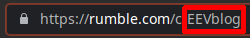

# shvss
Self Hosted Video Subscription Server

## Description
A server that displays youtube, odysee and rumble videos in chronological order based on what you add to the subs div.

## Installation
* install build requirements
```shell
# arch based
pacman -Sy go git
# debian based
apt install golang-go git
```
* install (systemd based)
```shell
git clone --depth 1 https://github.com/mericapewpew/shvss.git
cd shvss/
bash installer.sh install
```

## Adding subs
where to find required formats

### YouTube

---
* on a video, click share
* click embed
* click user picture in embed window

it will be the UC*************  in the url


### Odysee

---
in the url, including claim id


### Rumble

---
in the url

